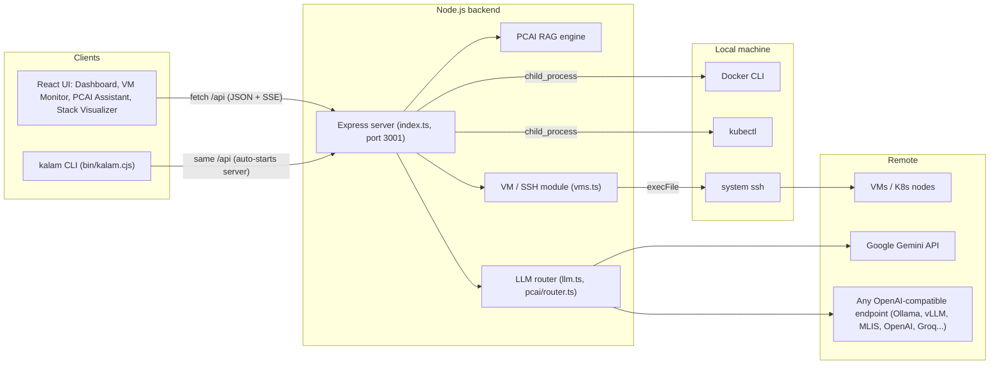
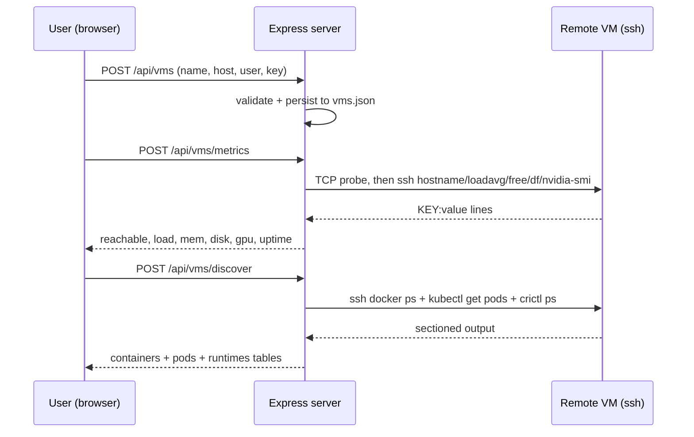
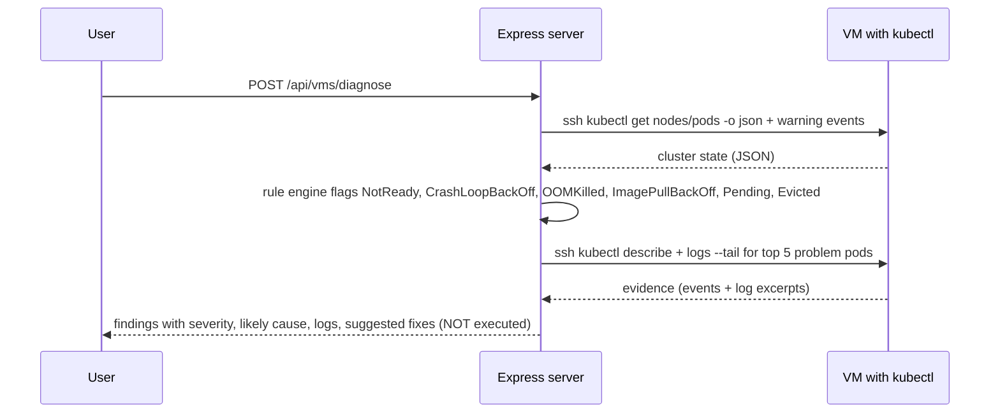
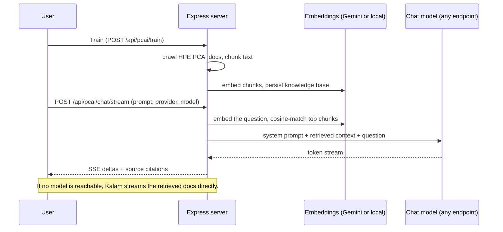
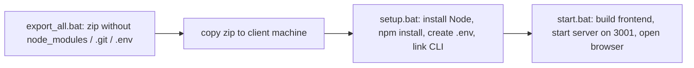
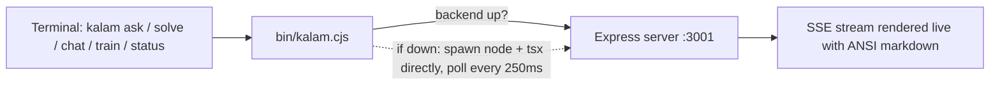

# Kalam — Architecture & Activity Flow

Kalam is a single-pane operations console for HPE Private Cloud AI (PCAI) environments:
it monitors VMs over SSH, inspects Docker/Kubernetes workloads, diagnoses cluster
problems read-only, and answers PCAI questions through a RAG-grounded AI assistant.

---

## 1. System overview

The browser never runs commands itself — every privileged action goes through the
Express backend, which shells out via Node's `child_process` (the same mechanism as
Python's `subprocess`).

---

## 2. Activity flows

### 2.1 VM monitoring & workload discovery

### 2.2 Read-only cluster diagnosis (Diagnose button)

The diagnostic engine **only inspects — it never fixes**. Every command it runs is
`kubectl get / describe / logs / events`. Fix suggestions are returned as text for a
human to review.

Failure patterns → diagnosis mapping (in `server/vms.ts`):

| Pattern | Likely cause | Suggested (reported-only) fix |
|---|---|---|
| CrashLoopBackOff | app crashing on start (config/env/dependency) | fix root error, rollout restart / undo |
| OOMKilled / exit 137 | memory limit too low or leak | raise memory limit, check `kubectl top` |
| ImagePullBackOff | wrong image, missing pull secret, no registry access | verify image, create `regcred`, fix tag |
| CreateContainerConfigError | missing ConfigMap/Secret | create the referenced object |
| Pending | unschedulable: resources / taints / PVC | read FailedScheduling event, adjust |
| Evicted | node disk/memory pressure | free disk, delete evicted record |
| Node NotReady | kubelet/containerd down, pressure | `systemctl status kubelet`, journal |

### 2.3 PCAI Assistant (RAG chat)

### 2.4 Model flexibility — any endpoint works

The chat provider is pluggable at three levels (Settings → AI Engine):

1. **Gemini** — Google API key (`.env` or UI).
2. **Local** — Ollama / LM Studio, with automatic model discovery and one-click pulls.
3. **Custom** — *any* OpenAI-compatible `/v1` endpoint: vLLM, HPE MLIS deployments,
   OpenAI, Groq, OpenRouter, Together, etc. Supply base URL + model + optional Bearer
   token. "Detect models" lists what the endpoint serves (authenticated `/models` call).

All non-Gemini traffic uses the standard OpenAI `chat/completions` protocol with
streaming, so a new provider needs zero code changes.

---

## 3. Why this tech stack

**TypeScript end-to-end (React + Node/Express), not Python/Flask:**

- **The product is UI-heavy.** The core value is the interactive single pane: React
  Flow / Cytoscape / Mermaid graph views, live-streaming chat, dashboards. That
  ecosystem is JavaScript-native; a Python backend would still need this exact
  frontend, adding a second language for no gain.
- **Node has the same OS powers as Python.** `child_process` (exec/execFile/spawn)
  covers everything `subprocess` does: running `kubectl`, `docker`, and `ssh`. All
  remote work shells out to the system `ssh` binary with argument arrays (no shell
  interpolation of user input) — no heavy SSH library needed.
- **One toolchain.** One `npm install`, shared types between client and server, one
  build (`tsc && vite build`), one runtime to install on a client machine. Flask +
  gunicorn/uvicorn would mean two runtimes, two dependency managers, and hand-kept
  JSON contracts.
- **Type safety across the wire.** API request/response shapes are TypeScript
  interfaces used by both sides; mismatches fail at compile time.
- **Streaming is first-class.** SSE token streaming from LLMs to the browser is a
  few lines in Express + `fetch` readers.
- **Simple deployment.** In production, Express also serves the built frontend from
  `dist/`, so the whole app is a single Node process on one port (3001) — which is
  what `start.bat` launches.

**Key choices inside the stack:**

| Choice | Why |
|---|---|
| Vite | instant dev server + fast production builds; `/api` proxy in dev |
| Express 5 | minimal, battle-tested HTTP layer; routers per domain (pcai, llm, vms) |
| system `ssh` via `execFile` | zero native deps, uses the user's keys/agent, args never shell-interpolated |
| SSE (not WebSockets) | one-directional streams (chat tokens, pull progress) — simpler, proxy-friendly |
| JSON file persistence (`vms.json`, KB store) | no database to install for a portable single-node tool |
| OpenAI-compatible protocol for all non-Gemini models | one client implementation covers every local and hosted provider |

---

## 4. Deployment / handoff flow

---

## 5. The `kalam` CLI

`bin/kalam.cjs` (registered globally by `npm link` / `setup.bat`) is a thin client of
the same Express API — it owns no logic of its own, so the UI and CLI always behave
identically.

Key behaviors:

- **Auto-start** — if the backend isn't running, the CLI spawns it via the local
  `tsx` binary through the current Node process (no `npx` resolver overhead) and
  polls readiness every 250 ms; once confirmed up, health checks are skipped for
  the rest of the session.
- **Interactive REPL** (`kalam` with no args) — streaming answers, slash commands
  (`/model`, `/provider`, `/mode`, `/train`, `/status`, `/run <n>`), intent routing
  (auto-detects ask vs. diagnose vs. DevOps from the message), and conversation
  memory. Prose streams token-by-token; headings, bullets, and code blocks are
  colored as lines complete.
- **Ctrl+C cancels, not kills** — during a streaming answer the first Ctrl+C aborts
  just that answer and returns to the prompt; when idle it exits.
- **One-shot + pipes** — `kalam ask "..."`, `kubectl logs pod | kalam solve`,
  `kalam list docker|k8s`, `kalam scan/fix <container>`.
- **Settings persistence** — provider/model/mode choices are saved to `~/.kalam.json`
  and merged with `.env` on startup, so the model you pick sticks across sessions.
