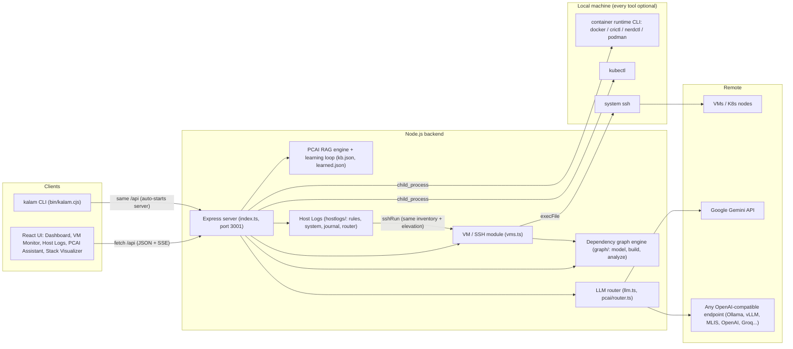
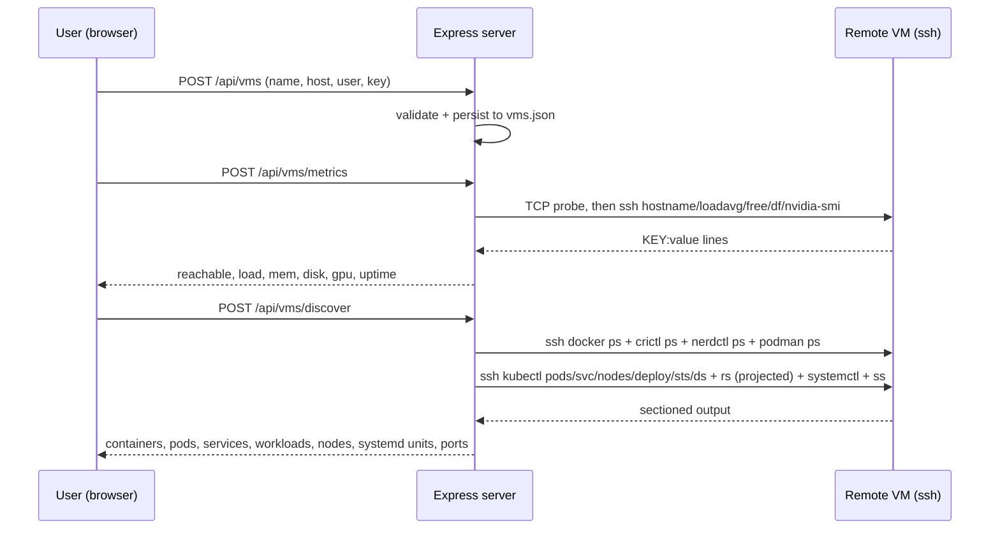
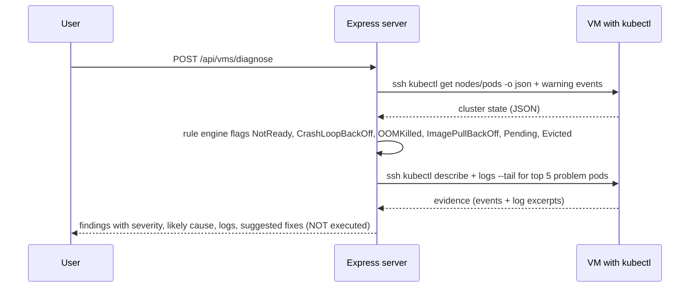
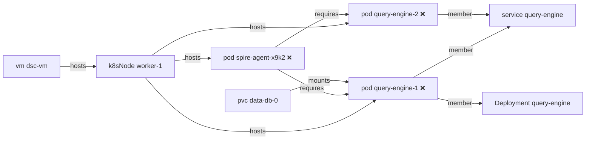
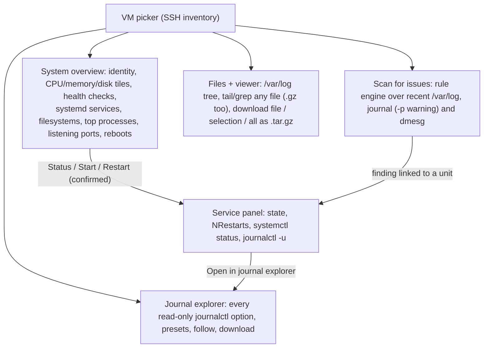
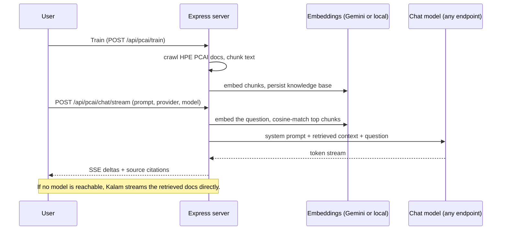
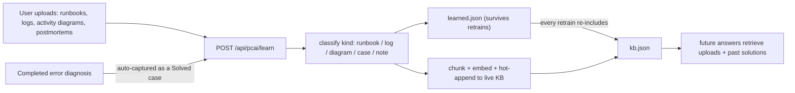
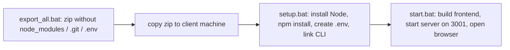
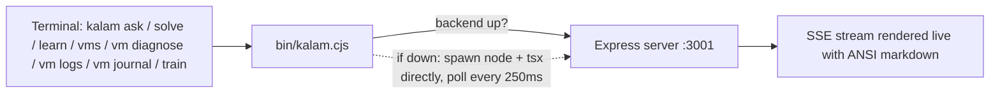

# Kalam — Architecture & Activity Flow

Kalam is a single-pane operations console for HPE Private Cloud AI (PCAI) environments:
it monitors VMs over SSH (including jump-host hops to VMs behind other VMs), inspects
Docker/Kubernetes workloads and services, diagnoses cluster problems read-only,
renders a live multi-host topology map, gives a whole-host view of any VM (health,
systemd services, `/var/log` and the systemd journal, with rule-based issue
detection), and answers PCAI questions through a RAG-grounded AI assistant that
keeps learning from your uploads and solved cases.

Security note: the API can run Docker/kubectl actions and SSH commands, so the
server binds to `127.0.0.1` only. Set `HOST=0.0.0.0` in `.env` to expose it on
the network deliberately.

---

## 1. System overview


```mermaid
flowchart LR
    subgraph B["Clients"]
        UI["React UI: Dashboard, VM Monitor, Host Logs, PCAI Assistant, Stack Visualizer"]
        CLI["kalam CLI (bin/kalam.cjs)"]
    end

    subgraph N["Node.js backend"]
        API["Express server (index.ts, port 3001)"]
        RAG["PCAI RAG engine + learning loop (kb.json, learned.json)"]
        VMS["VM / SSH module (vms.ts)"]
        HOSTLOGS["Host Logs (hostlogs/: rules, system, journal, router)"]
        GRAPH["Dependency graph engine (graph/: model, build, analyze)"]
        LLM["LLM router (llm.ts, pcai/router.ts)"]
    end

    subgraph L["Local machine (every tool optional)"]
        DOCKER["container runtime CLI: docker / crictl / nerdctl / podman"]
        KUBECTL["kubectl"]
        SSHBIN["system ssh"]
    end

    subgraph R["Remote"]
        VM["VMs / K8s nodes"]
        GEMINI["Google Gemini API"]
        ANY["Any OpenAI-compatible endpoint (Ollama, vLLM, MLIS, OpenAI, Groq...)"]
    end

    UI -->|"fetch /api (JSON + SSE)"| API
    CLI -->|"same /api (auto-starts server)"| API
    API --> RAG
    API --> VMS
    API --> HOSTLOGS
    HOSTLOGS -->|"sshRun (same inventory + elevation)"| VMS
    API --> GRAPH
    VMS --> GRAPH
    API --> LLM
    API -->|child_process| DOCKER
    API -->|child_process| KUBECTL
    VMS -->|execFile| SSHBIN
    SSHBIN --> VM
    LLM --> GEMINI
    LLM --> ANY
```

The browser never runs commands itself — every privileged action goes through the
Express backend, which shells out via Node's `child_process` (the same mechanism as
Python's `subprocess`).

---

## 2. Activity flows

### 2.1 VM monitoring & workload discovery


```mermaid
sequenceDiagram
    participant U as User (browser)
    participant S as Express server
    participant V as Remote VM (ssh)

    U->>S: POST /api/vms (name, host, user, key)
    S->>S: validate + persist to vms.json
    U->>S: POST /api/vms/metrics
    S->>V: TCP probe, then ssh hostname/loadavg/free/df/nvidia-smi
    V-->>S: KEY:value lines
    S-->>U: reachable, load, mem, disk, gpu, uptime
    U->>S: POST /api/vms/discover
    S->>V: ssh docker ps + crictl ps + nerdctl ps + podman ps
    S->>V: ssh kubectl pods/svc/nodes/deploy/sts/ds + rs (projected) + systemctl + ss
    V-->>S: sectioned output
    S-->>U: containers, pods, services, workloads, nodes, systemd units, ports
```

A host added on the Virtual Machines tab is **explored immediately**: Kalam runs
that discovery once and reports what it found ("Mapped: 12 containers, 30 pods,
8 services") in the row, so an unreachable host or a login that cannot see
containerd says so at the moment it is added rather than looking like an empty
cluster later. Granting root re-runs it, because that is exactly when the
previously invisible half of the machine appears.

### 2.1a Node Brain — explaining a discovered node

Discovery lists *what* runs on a node; **Node Brain** (`POST /api/vms/explain`)
explains *what it means*. One read-only SSH round trip gathers host facts
(`hostname`/`uname`/`uptime -s`/`os-release`), `kubectl get nodes|pods|events`,
running systemd units, service start timestamps, and the package log. The server
then:

1. **Identity** — matches the SSH host to its cluster node (by short hostname,
   `Hostname` address, or InternalIP), and reports role (control-plane vs worker),
   CPU/RAM/GPU capacity, kubelet + runtime versions, taints, and notable labels.
2. **What runs here and why** — every pod on that node (plus recognized systemd
   units) is matched against the component catalog in
   `server/pcai/components.ts`, which answers three questions per component:
   *what it is*, *why it runs on this node*, and *what breaks if it stops*.
   E.g. `spire-agent` → workload attestation must happen on the workload's own
   machine; `kyverno` → admission webhook whose `failurePolicy` decides whether
   an outage blocks all deploys or silently skips policy. Matching is lexical
   (pod name + owner + image + namespace), so it needs no LLM and works offline.
   Unmatched pods are listed separately as application workloads.
3. **Recent changes** — a merged timeline of host reboot, kubelet/containerd
   restarts, pods scheduled or containers restarted in the last 7 days (with
   image and exit reason), and host package installs/upgrades.

Nothing is modified: the endpoint runs only `kubectl get`, `systemctl show`, and
read-only host commands.

### 2.1c VM topology

`src/components/VmTopology.tsx` draws the same inventory as a ReactFlow graph
(dagre, left-to-right): **Kalam → jump hosts → VMs → component categories**. A VM
with `via` set is rendered as a child of its jump host, so the real SSH path is
visible; edges animate green when the host is reachable and go dashed grey when
it is not. Each VM card carries live metrics and, once the Node Brain scan has
run, expands into one card per component category (colored per category, red when
something in it is unhealthy). It is presentational — VmMonitor owns the
inventory, metrics and brain state and passes them down.

### 2.1b Peer VMs & SSH jump hosts

From any connected VM (e.g. a DSC VM), "Find peer VMs" discovers other hosts it can
see — Kubernetes cluster nodes (`kubectl get nodes -o wide`), `/etc/hosts` entries,
and ARP neighbors — and offers to add them with the source VM as an **SSH jump
host**. A VM with `via` set is reached through `ProxyCommand` (the hop honors the
jump VM's own port and key), so a VME host that is only visible from the DSC VM
still gets full metrics, discovery, and diagnosis. Reachability for jumped VMs is
probed via the jump host, since the local machine cannot see them directly.

### 2.2 Read-only cluster diagnosis (Diagnose button)

The diagnostic engine **only inspects — it never fixes**. Every command it runs is
`kubectl get / describe / logs / events`. Fix suggestions are returned as text for a
human to review.


```mermaid
sequenceDiagram
    participant U as User
    participant S as Express server
    participant V as VM with kubectl

    U->>S: POST /api/vms/diagnose
    S->>V: ssh kubectl get nodes/pods -o json + warning events
    V-->>S: cluster state (JSON)
    S->>S: rule engine flags NotReady, CrashLoopBackOff, OOMKilled, ImagePullBackOff, Pending, Evicted
    S->>V: ssh kubectl describe + logs --tail for top 5 problem pods
    V-->>S: evidence (events + log excerpts)
    S-->>U: findings with severity, likely cause, logs, suggested fixes (NOT executed)
```

Failure patterns → diagnosis mapping (in `server/vms.ts`):

| Pattern | Likely cause | Suggested (reported-only) fix |
|---|---|---|
| CrashLoopBackOff | app crashing on start (config/env/dependency) | fix root error, rollout restart / undo |
| OOMKilled / exit 137 | memory limit too low or leak | raise memory limit, check `kubectl top` |
| ImagePullBackOff | wrong image, missing pull secret, no registry access | verify image, create `regcred`, fix tag |
| CreateContainerConfigError | missing ConfigMap/Secret | create the referenced object |
| Pending | unschedulable: resources / taints / PVC | read FailedScheduling event, adjust |
| Evicted | node disk/memory pressure | free disk, delete evicted record |
| Node NotReady | kubelet/containerd down, pressure | `systemctl status kubelet`, journal |

### 2.2a The dependency graph — telling causes apart from casualties

Diagnosis on its own produces a *list*: fourteen red pods, each with its own
suggested fix. But in a real outage thirteen of them are usually downstream of
one failure. `server/graph/` is the model that knows the difference.

**One contract governs the whole model** (`graph/model.ts`):

```
from --kind--> to      means      "to depends on from"
```

so failure flows *forward* along every arrow. Everything else follows from it:
a blast radius is the set reachable forward from a node, and a root cause is a
failure with no failed ancestor.


```mermaid
flowchart LR
    VM["vm dsc-vm"] -->|hosts| KN["k8sNode worker-1"]
    KN -->|hosts| SA["pod spire-agent-x9k2 ❌"]
    KN -->|hosts| P1["pod query-engine-1 ❌"]
    KN -->|hosts| P2["pod query-engine-2 ❌"]
    SA -->|requires| P1
    SA -->|requires| P2
    PVC["pvc data-db-0"] -->|mounts| P1
    P1 -->|member| SVC["service query-engine"]
    P2 -->|member| SVC
    P1 -->|member| DEP["Deployment query-engine"]
```

| Edge | Meaning |
|---|---|
| `hosts` | machine hosts workload: `vm → k8sNode → pod` (also `vm → container/unit`) |
| `via` | SSH jump path: the jump host is the only route to the VM |
| `member` | pod backs an aggregate: `pod → service` (real selector match), `pod → workload` |
| `mounts` | `pvc → pod` — an unbound claim keeps the pod in ContainerCreating |
| `binds` | a process owns a listening port |
| `requires` | **platform dependency, derived from the component catalog** |

`requires` is where the existing knowledge finally does work. `components.ts`
already stated in prose that a dead SPIRE agent means "newly scheduled pods on
this node never get an identity". `graph/deps.ts` turns that sentence into
edges, in three tiers that also keep the graph acyclic by construction:

- **cluster** (`etcd`, `kube-apiserver`, `coredns`, `spire-server`, `cert-manager`) — everything in the cluster depends on it.
- **node** (`kubelet`, `containerd`, `kube-proxy`, CNIs, `spire-agent`, `spiffe-csi`, CSI drivers, `nvidia-device-plugin`) — every workload *on the same node* depends on it.
- **workload** — ordinary application pods: they depend, nothing depends on them.

Edges only run from a lower tier to a higher one, so a cluster-wide failure
correctly outranks (and absorbs) a node-local one. A test asserts every id in
these tables still resolves to itself in the catalog, so the two cannot drift.

**Three questions the graph answers** (`graph/analyze.ts`):

| Function | Question | How |
|---|---|---|
| `analyzeCauses` | "Which of these 14 red things do I fix?" | a broken node with no broken *ancestor* is a root cause; everything else is attributed to its nearest broken ancestor and ranked by how much breakage it explains |
| `blastRadius` | "What do I take down if I restart this?" | forward BFS with hop distance, split into *already broken* (damage done) and *at risk* (damage stopping it would do) |
| `dependencyPath` | "Why does that affect this?" | shortest forward path, each edge carrying the sentence explaining why it exists |

Aggregates have no health of their own: a Service or Deployment is exactly as
healthy as the pods behind it — all members broken is `failed`, some is
`degraded`.

```
POST /api/graph/build   { name }           -> graph + stats + ranked causes
POST /api/graph/causes  { name }           -> causes vs collateral
POST /api/graph/blast   { name, id }       -> what breaks if `id` stops
POST /api/graph/path    { name, from, to } -> why `from` affects `to`
GET  /api/graph/:name                      -> the cached graph
```

One read-only SSH round trip (`kubectl get nodes|pods|svc|pvc`, `docker ps`,
`crictl ps`, `systemctl list-units`, `ss -tuln`) builds it; the result is cached per VM so
blast-radius and path queries are free. `server/graph/build.ts` is pure — no
SSH, no fs, no Express — so the entire edge model is tested from fixtures.

**Where it shows up:** `/api/vms/diagnose` now builds the graph from the same
snapshot it diagnoses, so every finding carries `rootCause`, `explains`, or
`causedBy`, and findings are ordered causes-first. The UI adds a "Start here"
panel and dims collateral findings; the CLI gains `kalam vm graph <name>` and
`kalam vm impact <name> <id>`.

### 2.2b Object inspect — YAML, describe, events, and what it connects to

The graph above answers *cluster-wide* questions. The inspect API answers the
question asked one card at a time: "I clicked this pod — what is it, and what is
it wired to?" `server/k8s/inspect.ts` goes back to the cluster for the whole
object, and `server/k8s/relate.ts` turns that snapshot into connections.

```
GET /api/k8s/inspect/:kind/:namespace/:name[?vm=<name>]   -> full object + relations
GET /api/k8s/inspect/node/:name[?vm=<name>]               -> cluster-scoped form
GET /api/docker/inspect/:id[?vm=<name>]                   -> docker inspect JSON
```

**No Docker dependency.** Container discovery (`server/vms.ts: parseContainers`)
probes docker, containerd (`crictl ps -a`), nerdctl and podman in the same SSH
round trip and normalizes all of them into one `containers[]` list, each entry
tagged `runtime`. A missing binary is a no-op, so a plain Kubernetes node —
which has only containerd — fills the dashboard like any other host. Locally,
`/api/status` probes the same four runtimes in parallel with a hard timeout and
reports them as `runtimes[]`; `/api/docker/containers` answers `[]` rather than
an error when Docker is absent, so nothing docker-shaped can poison client
state. The UI's source picker adds **All hosts**, which fans `/api/vms/discover`
out over the inventory and merges the results, stamping each resource with its
`host` so the drawer's logs and actions still reach the right machine.

**Engine connection test.** `POST /api/llm/test` proves the configured AI engine
answers end to end — a real (tiny) completion, not a ping — and classifies a
failure by what the wire actually did (`describeConnectError`): host not
resolvable (off the VPN), timeout/unreachable, refused port, untrusted internal
certificate, http-vs-https, token rejected, model not served. The call is made by
the Node backend, so it is the machine running Kalam that must be on the
endpoint's network.

One call returns the object's `yaml`, its `describe`, its recent `events`
(newest first), a `summary` of the fields a describe would show, per-container
detail (image, ports, requests/limits, probes, restarts, mounts, command), its
labels/annotations, and `groups` of related objects. `?vm=` runs the same
read-only `kubectl get`/`describe` over SSH, folded into one round trip with
`@@TAG@@` markers, so a remote VM source behaves identically to the local one.

Relations are computed, never guessed by name:

| From | Finds |
|---|---|
| Pod | owning workload (ReplicaSet collapsed to its Deployment), Services whose **selector** matches — annotated with whether this pod is actually a *ready endpoint*, the Ingress publishing those Services, its node, its ConfigMaps / Secrets / PVCs / ServiceAccount (volumes, `envFrom`, single env keys, image pull secrets), and its sibling replicas |
| Deployment / StatefulSet / DaemonSet | pods matching its selector, Services matching its **pod template** labels, Ingresses, node spread, template config refs |
| Service | Endpoints split into serving vs not-serving pods, the workloads behind them, Ingresses |
| Node | pods scheduled on it, the Services that therefore depend on it, capacity/taints/pressure |

`relate.ts` is pure — it takes parsed `kubectl -o json` and returns plain data —
so every rule above is unit-tested from fixtures in
`server/__tests__/relate.test.ts`. Secrets are deliberately not an inspectable
kind: the endpoint hands back raw YAML.

**Where it shows up:** the topology map's detail drawer gains **Related**,
**YAML/JSON** (with Describe toggle, copy and download) and **Events** tabs, and
its Details tab now shows the live object rather than the fields the list
endpoint happened to carry. Clicking a related object jumps to its card.

### 2.2c Change history — what changed, when, and who did it

Everything above looks at the cluster as it is *now*. Kubernetes is bad at
remembering: events expire after roughly an hour, a rolled-back Deployment
leaves almost no trace, and a pod deleted at 3am is simply gone by morning.
`server/history/` is the only part of Kalam with a memory.

**It stores fingerprints, not manifests.** Each capture reduces every object to
the handful of fields whose change is worth reporting — image, replicas,
selector, taints, ports, rules — as flat strings (`server/history/fingerprint.ts`).
Two fingerprints diff into field-level before→after pairs, and only those diffs
are persisted. A 500-object cluster fingerprints to tens of kilobytes, and a
quiet hour costs nothing because nothing changed.

```
POST /api/history/capture  { source }         -> capture, diff, append
GET  /api/history          ?source&since&kind&severity&q   -> the timeline
GET  /api/history/object/:kind/:ns/:name      -> one object + rollout revisions
GET  /api/history/summary  ?since=24h         -> key -> last change (heatmap)
GET  /api/history/status                      -> poller + storage state
```

**Three guards come before any diffing** (`server/history/diff.ts`), because the
failure mode of a naive diff is not a missing entry but a confident, wrong one:

| Guard | Prevents |
|---|---|
| **Baseline** — no previous snapshot means no changes | Announcing that all 500 objects were "created" the moment Kalam starts |
| **Section** — a kind is diffed only when its query succeeded on *both* sides | A lost RBAC permission or a missing Ingress API reading as mass deletion |
| **Sanity** — a capture that lost >50% of its objects is a bad read | A truncated SSH transfer reading as a catastrophe |

Classification is driven by *which field moved*: an image string is a deploy,
`unschedulable` flipping is a cordon, `node` moving on a pod is a reschedule.
That is why the timeline reads as sentences rather than a JSON diff.

**Attribution without an audit log.** `metadata.managedFields` records, per
writer, which fields it owns and when — so `helm`, `kubectl-client-side-apply`
or a controller can be named. kubectl hides it unless `--show-managed-fields=true`
is passed, so a capture that fails is retried once without the flag: attribution
degrades, history does not. A change is credited to a manager only when its
timestamp *moved* since the last capture — comparing two cluster-supplied
timestamps, never Kalam's clock, so host/cluster skew cannot mislead it.
Deployment rollout revisions are read on demand from the ReplicaSets, where
`kubernetes.io/change-cause` carries whatever note the operator left.

**Nothing sensitive is written.** Inline env values are stored as digests, never
plaintext; ConfigMaps and Secrets are tracked by `resourceVersion` alone, so
Kalam never reads their contents. `server/history/data/` is gitignored.

**Collection is opt-in.** `KALAM_HISTORY=1` starts the poller
(`KALAM_HISTORY_INTERVAL_SEC`, default 300; `KALAM_HISTORY_SOURCES`, default
`local`, or `all`), captures run sequentially with an in-flight guard, and the
timer is unref'd. Without it, history advances only when someone presses
"Capture now". Every query is `kubectl get`.

**Where it shows up:** a "Change History" tab (`src/components/ClusterHistory.tsx`)
with a filterable day-grouped timeline and expandable field diffs; a **Changes**
tab in the topology drawer showing one object's history plus its rollout
revisions; a "Recently changed" heatmap mode on the map; and
`kalam history [--source x] [--since 7d]` / `kalam history capture` in the CLI.

### 2.2d Host Logs — system health, services, `/var/log` and the journal

Everything above is about the *cluster*. When a node misbehaves, the answer is
usually on the host itself: a full disk, an OOM kill, a failed `containerd`, a
flapping NIC. The **Host Logs** tab (`src/components/HostLogs.tsx`) is a
whole-machine view of any VM in the SSH inventory. The backend lives in
`server/hostlogs/` and reaches hosts only through `sshRun`, so jump hosts and
sudo/su elevation work exactly as they do on the Virtual Machines tab.

```
server/hostlogs/
  rules.ts    pure: log rule engine, message grouping, /var/log path confinement
  system.ts   pure: parsers (free, df, systemctl, ps, ss), health checklist,
              finding → systemd unit linking, service-name validation
  journal.ts  pure: structured query → validated, quoted journalctl command
  router.ts   the SSH round-trips and HTTP endpoints below
```

The page is five panels over one host:


```mermaid
flowchart TB
    PICK["VM picker (SSH inventory)"] --> OV & SCAN & JX & FILES
    OV["System overview: identity, CPU/memory/disk tiles, health checks,<br/>systemd services, filesystems, top processes, listening ports, reboots"]
    SCAN["Scan for issues: rule engine over recent /var/log, journal (-p warning) and dmesg"]
    JX["Journal explorer: every read-only journalctl option, presets, follow, download"]
    FILES["Files + viewer: /var/log tree, tail/grep any file (.gz too), download file / selection / all as .tar.gz"]
    OV -->|"Status / Start / Restart (confirmed)"| SVC["Service panel: state, NRestarts, systemctl status, journalctl -u"]
    SCAN -->|"finding linked to a unit"| SVC
    SVC -->|"Open in journal explorer"| JX
```

**API** (every call takes `{ name }` — the VM is looked up in the inventory, never
taken as a raw host):

| Endpoint | Changes the host? | What it runs |
|---|---|---|
| `POST /api/logs/overview` | no | `id`, `/etc/os-release`, `/proc/uptime`, `/proc/loadavg`, `free -b`, `df -PT` / `df -Pi`, `systemctl list-units --type=service --all`, `ps --sort`, `ss -tulnp`, `timedatectl show`, `last -x reboot` — one round trip |
| `POST /api/logs/scan` `{ hours }` | no | newest ≤40 text logs changed in the window, `tail -n 5000` each through a keyword pre-filter, `journalctl -p warning --since`, `dmesg --level=err,warn`, plus the unit list for linking |
| `POST /api/logs/list` | no | `find /var/log -maxdepth 3 -type f` (+ `! -readable` to flag no-access files) |
| `POST /api/logs/read` `{ path, lines, grep }` | no | `tail -n`, or `zcat`/`xzcat`/`bzcat`/`zstdcat` + `grep -F` + `tail`; `last -f` for wtmp/btmp |
| `POST /api/logs/download` `{ paths? \| path+raw }` | no | `tar czf` (or the single file) → base64 over SSH → decoded, capped at `KALAM_LOG_BUNDLE_MAX_MB` |
| `POST /api/logs/service` `{ unit, action }` | **`start` / `restart`** | `systemctl show`, `systemctl status`, `journalctl -u -n 80`; for start/restart first `systemctl <action>` |
| `POST /api/logs/journal` `{ query }` | no | `journalctl` built by `journal.ts` (see below) |
| `POST /api/logs/journal/meta` | no | `--list-boots`, `-F _SYSTEMD_UNIT`, `-F SYSLOG_IDENTIFIER`, `-N`, `--disk-usage`, journald.conf, persistent vs volatile |
| `POST /api/logs/journal/field-values` `{ field }` | no | `journalctl -F FIELD` |
| `POST /api/logs/journal/download` `{ query }` | no | same query, saved as `.log` / `.json` |
| `POST /api/logs/journal/check` `{ op }` | no | `journalctl --verify` or `--header` |
| `GET /api/logs/rules` | — | the rule catalogue |

**Detection is deterministic, not an LLM.** `rules.ts` holds ~18 rules in
priority order — kernel panic/lockup, OOM killer, disk full, filesystem errors,
block I/O errors, MCE/EDAC/AER hardware errors, NVIDIA Xid, segfaults, failed
systemd units, kubelet/containerd errors, TLS/certificate failures, SSH/PAM
auth failures, sudo denials, clock skew, link/DNS/conntrack problems — then
generic fatal/error/warning fallbacks. Lines are grouped by rule + a normalized
message (timestamps, PIDs, IPs, hex and numbers stripped), so 400 identical
`Invalid user` lines become one finding with a count, first/last seen and
samples. Each rule carries its own explanation and read-only checks, which is
what the **Explain** toggle shows — it works on an air-gapped host with no model
configured. The remote keyword pre-filter (`PREFILTER`) keeps transfer small;
a unit test asserts it never drops a line any rule would match.

**Health checks** (`buildHealth`) reduce the overview to ok / warning / critical:
disk and inode use ≥80/90%, available memory <20/10%, swap >50%, 5-minute load
per CPU >1/2, failed or restarting units (critical for core node services such
as kubelet, containerd, etcd, sshd, NetworkManager), stopped core services, NTP
not synchronized, reboot within the last hour, not running as root.

**Linking findings to services.** `unitsForLines` maps a finding's sample lines
to units that exist on that host: an explicit `foo.service`, the syslog
identifier (`kubelet[900]:` → `kubelet.service`, `sshd` → `ssh.service`), or
systemd's `Failed to start <Description>`. That is what puts a **Restart
kubelet.service** button next to a PLEG error.

**The one mutating action: `systemctl start|restart`.** It is guarded in layers:

| Guard | Where |
|---|---|
| Browser confirmation, with a stronger warning for core units and for SSH/network units (`ACCESS_UNITS`) that can cut access | `HostLogs.tsx` |
| Server refuses without `confirm: true` | `router.ts` |
| Only `status`, `start`, `restart` — no `stop`, `disable`, `mask` | `router.ts` |
| Unit name validated (`safeServiceUnit`) and shell-quoted | `system.ts` |
| Unit must exist on the host (`LoadState=loaded`) before `systemctl` runs | remote pre-check |
| Every start/restart logged with time, unit, VM and login | server log |
| A dropped SSH connection while restarting sshd/networking is reported as expected, not as a failure | `router.ts` |

Service control needs root; a non-root login without elevation gets a message
pointing at the root-access setting, not a raw `Interactive authentication
required`. Note that this goes over SSH, so the Helm `rbac.allowWrite` switch
(which governs Kubernetes writes) does not apply to it.

**Journal explorer.** `journal.ts` turns a structured query into a `journalctl`
command: `-u` (globs), `-t`, `-k`, `-p` level or range (ordered for the user),
`-b` index or boot ID, `--since/--until` (validated against systemd.time forms;
`datetime-local` input normalized), `FIELD=value` matches, `-g` with
`--case-sensitive` or a fixed-string `grep -F` whose line limit applies after
filtering, `-o` (12 modes), `--output-fields`, `-n` (≤20000), `-r`, `-x`,
`--utc`, `--no-hostname`. Every value is validated and quoted; invalid fields
come back as readable errors and the exact command is shown for copying.
`-f` is replaced by polling: `--show-cursor` on the first request, then
`--after-cursor=<cursor>` every 3 s, so no stream is held open. An option the
host's `journalctl` is too old for is reported as such.

**Deliberately not offered:** `journalctl --vacuum-*`, `--rotate`, `--flush`,
`--sync` (they delete or rewrite logs — a page for investigating incidents must
not be able to destroy the evidence), `--file` / `-D` / `-M` / `--user` (other
journals), and `systemctl stop` (stopping sshd or networking locks you out).

**Limits are reported, never silent.** Downloads above the cap return
`X-Kalam-Truncated: 1` and the UI says so; scan output that hits the SSH buffer
is flagged partial; files unreadable to a non-root login are badged and
explained. Hosts whose `find` lacks `-printf` (BusyBox) still list files via
`stat`, but the scan then reads only the journal and dmesg.

Tests: `server/__tests__/hostlogs.test.ts` (rules, grouping, pre-filter, path
confinement), `hostsystem.test.ts` (parsers, health, unit linking, unit-name
validation), `hostjournal.test.ts` (every journal option, injection rejection,
cursors, `--list-boots` formats; generated commands are syntax-checked with
`bash -n` where bash is available).

### 2.3 PCAI Assistant (RAG chat)


```mermaid
sequenceDiagram
    participant U as User
    participant S as Express server
    participant E as Embeddings (Gemini or local)
    participant M as Chat model (any endpoint)

    U->>S: Train (POST /api/pcai/train)
    S->>S: crawl HPE PCAI docs, chunk text
    S->>E: embed chunks, persist knowledge base
    U->>S: POST /api/pcai/chat/stream (prompt, provider, model)
    S->>E: embed the question, cosine-match top chunks
    S->>M: system prompt + retrieved context + question
    M-->>S: token stream
    S-->>U: SSE deltas + source citations
    Note over S,U: If no model is reachable, Kalam streams the retrieved docs directly.
```

### 2.4 Model flexibility — any endpoint works

The chat provider is pluggable at three levels (Settings → AI Engine):

1. **Gemini** — Google API key (`.env` or UI).
2. **Local** — Ollama / LM Studio, with automatic model discovery and one-click pulls.
3. **Custom** — *any* OpenAI-compatible `/v1` endpoint: vLLM, HPE MLIS deployments,
   OpenAI, Groq, OpenRouter, Together, etc. Supply base URL + model + optional Bearer
   token. "Detect models" lists what the endpoint serves (authenticated `/models` call).

All non-Gemini traffic uses the standard OpenAI `chat/completions` protocol with
streaming, so a new provider needs zero code changes.

### 2.5 The learning loop (self-improving knowledge base)


```mermaid
flowchart LR
    UP["User uploads: runbooks, logs, activity diagrams, postmortems"] --> LEARN["POST /api/pcai/learn"]
    DIAG["Completed error diagnosis"] -->|"auto-captured as a Solved case"| LEARN
    LEARN --> CLASSIFY["classify kind: runbook / log / diagram / case / note"]
    CLASSIFY --> STORE["learned.json (survives retrains)"]
    CLASSIFY --> HOT["chunk + embed + hot-append to live KB"]
    STORE -->|"every retrain re-includes"| KB["kb.json"]
    HOT --> KB
    KB --> ANSWER["future answers retrieve uploads + past solutions"]
```

- Any text document fed via `kalam learn <file>` (or the API) is classified,
  chunked, embedded, and immediately usable in answers.
- Every completed diagnosis is saved back as a "Solved case" (problem +
  resolution), so the next similar error retrieves the previous fix. Cases rotate
  at 200; manual uploads are never rotated out.
- Learned docs live in `server/pcai/learned.json`, separate from `kb.json`, so a
  full retrain rebuilds the KB **with** them instead of losing them.

### 2.6 Topology map

The Topology view (`src/components/TopologyGraph.tsx`, React Flow) draws the
cluster as a left-to-right pipeline banded by namespace: containers on the left,
then Services → Workloads → Pods, with cluster Nodes on the right.

It is built from three **pure modules**, none of which import React. That split
is deliberate: a map is either correct or it is not, and correctness here means
properties that can be asserted rather than eyeballed.

```
kubectl / ssh  ─►  server/k8s/workloads.ts   normalize: owners, selectors, kinds
                        │
                        ▼
                   src/lib/relations.ts      which cards connect, and why
                        │
                        ▼
                   src/lib/layout.ts         where every card sits
                        │
                        ▼
               TopologyGraph.tsx             React Flow rendering only
```

**`server/k8s/workloads.ts` — the data a topology needs.** Feeds both the local
endpoint and the SSH path, so a VM and this machine produce identical shapes.
It carries the two fields every edge depends on and which were previously
dropped: a Service's `spec.selector`, and a Pod's owner resolved *through* its
ReplicaSet to the Deployment a human would name. StatefulSets and DaemonSets are
first-class workloads here — a map that knows only Deployments leaves every
database and queue pod unattached.

ReplicaSets are fetched as four projected columns
(`-o custom-columns=NS,NAME,OKIND,ONAME`), never as JSON. They are consulted
only for owner resolution, and Kubernetes retains ten revisions per Deployment
by default, which makes their full JSON routinely the largest object in a
cluster — 246 KB on a 33-pod laptop cluster versus 3 KB projected, and far wider
apart on a real one. Pulling that through an SSH round trip is not viable.

**`src/lib/relations.ts` — edges from Kubernetes semantics, not from names.**

| Edge | Derived from |
|---|---|
| Workload → Pod (`manages`) | `ownerReferences`, resolved through the ReplicaSet |
| Service → Pod (`routes`) | label selector matched against pod labels |
| Pod → Node (`runs-on`) | `spec.nodeName` |
| Pod → Container (`backs`) | crictl's pod field, or the `k8s_…` Docker name |
| Node → Container (`hosts`) | only for containers not already inside a pod |

Name matching survives *only* as a clearly-marked fallback for payloads that
carry nothing better, and such edges are drawn fainter and labelled with a `?`.
A pod whose owner is known but has no card (a static control-plane pod owned by
its Node) gets no edge at all — a known owner is an answer, not a gap, and
guessing a different parent would invent a relationship the cluster does not
have.

**`src/lib/layout.ts` — geometry with checkable properties.** Stages wrap into
balanced, top-aligned grids rather than growing into one endless column, and
blocks are biased ~1.6x wider than tall because the canvas is scaled to fit a
wide dashboard panel: height is what forces every card to shrink past
readability. Pods are ordered by owning workload so a workload's edges leave as
one bundle. Each namespace gets its own band; each stage owns its own column
range across every band.

**Timeouts are two-layered, on purpose.** `kubectl --request-timeout` defaults
to `0` — it waits on an unresponsive API server forever — and the dashboard
polls every 10 s, so an unbounded read accumulates stuck processes. But an outer
process kill cannot be the primary bound: `SIGKILL` destroys the reason, which
is how a merely slow cluster once reported itself as empty. kubectl therefore
carries its own `--request-timeout`, derived from `KALAM_KUBECTL_TIMEOUT_MS`
(default 120 s) and set below it, so it always gets to explain itself; the
process timeout remains only as a backstop for a genuinely wedged kubectl. The
separate 8 s probe timeout stays short, because a stopped Docker Desktop on
Windows blocks with no error of its own and the only cure is to stop waiting.

**`npm run diagnose`** (`scripts/diagnose-host.ts`) runs this whole pipeline
against a real host — or `--local`, this machine — and reports every stage:
login identity, runtimes, kubeconfig context, whether the identity may list
pods, per-kind counts with sizes and timings, the exact kubectl error for
anything that failed, and the resulting relations and canvas. It is the first
thing to run when a view is emptier than the cluster.

**`npm run topology:check`** (`scripts/topology-report.ts`) computes the real
positions, prints the canvas as an ASCII map, and **asserts**: no card overlaps
another, stage column ranges never interleave, namespace bands never overlap, no
card escapes its band, no stage collapses to a single column, and the aspect
ratio is usable. It exits non-zero on failure, so it can gate a release. It runs
against live `kubectl`, a JSON snapshot, or a running Kalam — including a remote
source:

```bash
npm run topology:check                                             # live kubectl
npm run topology:check -- http://localhost:3001/api/k8s/resources  # what the browser gets
npm run topology:check -- snapshot.json
```

Everything above is unit-tested from fixtures (`src/lib/__tests__/relations.test.ts`,
`src/lib/__tests__/layout.test.ts`, `server/__tests__/workloads.test.ts`).

Around that core the view adds:

- **Source selector** — this machine, any SSH-connected VM, or **All hosts**,
  which fans discovery across the inventory and merges the results. Each merged
  resource carries the host it came from, so the drawer's logs and actions still
  reach the right machine.
- **Live mode** — re-polls the active source every 8 s; LEDs and edges update in
  place.
- **Problems-only focus** — hides healthy resources; shows failures plus
  everything they connect to.
- **Layouts** — the banded pipeline above, or "Auto Flow" computed from the same
  edges with `@dagrejs/dagre`.

### 2.7 The remote terminal and root

`/api/vms/exec` runs one command per connection in a non-interactive shell,
which is why so much of what people typed did not work: `cd` was forgotten,
exported variables vanished, anything that prompted hung, and tools needing a
TTY refused to start. `server/shell.ts` keeps **one real login shell open per
session on a PTY** instead, streamed to the browser over SSE:

```
POST /api/vms/shell/open   { name, cols, rows, asRoot } -> { id }
GET  /api/vms/shell/:id/stream    server-sent raw output (with scrollback replay)
POST /api/vms/shell/:id/input     keystrokes, control characters included
POST /api/vms/shell/:id/resize | /close
```

Sessions are in-memory, capped, and reaped after 30 minutes idle.

The Virtual Machines tab offers **two** terminal buttons: a normal shell, and a
**Root terminal** that elevates on any host whether or not elevation is
configured for it.

**Elevation is driven by what the shell says, never by a timer.** An earlier
version wrote the stored password on a fixed delay; on a host with passwordless
sudo there is no prompt at all, so the password was typed into the freshly
opened root shell as a command — echoed on screen and recorded in root's shell
history. `elevationStep()` is a pure function over the output seen so far: it
sends the password only in response to a prompt genuinely waiting for one, once,
inside a bounded window, and stops on `Sorry, try again` / `not in the sudoers
file` / `su: Authentication failure`. If no password is stored, nothing is sent
and the user simply types it — which is the point of a real terminal.
`server/__tests__/shell.test.ts` pins every one of those cases.

---

## 3. Why this tech stack

**TypeScript end-to-end (React + Node/Express), not Python/Flask:**

- **The product is UI-heavy.** The core value is the interactive single pane: the
  React Flow topology map, Mermaid diagram views, live-streaming chat, dashboards.
  That ecosystem is JavaScript-native; a Python backend would still need this exact
  frontend, adding a second language for no gain.
- **Node has the same OS powers as Python.** `child_process` (exec/execFile/spawn)
  covers everything `subprocess` does: running `kubectl`, `docker`, and `ssh`. All
  remote work shells out to the system `ssh` binary with argument arrays (no shell
  interpolation of user input) — no heavy SSH library needed.
- **One toolchain.** One `npm install`, shared types between client and server, one
  build (`tsc && vite build`), one runtime to install on a client machine. Flask +
  gunicorn/uvicorn would mean two runtimes, two dependency managers, and hand-kept
  JSON contracts.
- **Type safety across the wire.** API request/response shapes are TypeScript
  interfaces used by both sides; mismatches fail at compile time.
- **Streaming is first-class.** SSE token streaming from LLMs to the browser is a
  few lines in Express + `fetch` readers.
- **Simple deployment.** In production, Express also serves the built frontend from
  `dist/`, so the whole app is a single Node process on one port (3001) — which is
  what `start.bat` launches.

**Key choices inside the stack:**

| Choice | Why |
|---|---|
| Vite | instant dev server + fast production builds; `/api` proxy in dev |
| Express 5 | minimal, battle-tested HTTP layer; routers per domain (pcai, llm, vms) |
| system `ssh` via `execFile` | zero native deps, uses the user's keys/agent, args never shell-interpolated |
| SSE (not WebSockets) | one-directional streams (chat tokens, pull progress) — simpler, proxy-friendly |
| JSON file persistence (`vms.json`, `kb.json`, `learned.json`) | no database to install for a portable single-node tool |
| OpenAI-compatible protocol for all non-Gemini models | one client implementation covers every local and hosted provider |
| `@dagrejs/dagre` for auto-layout | maintained fork of dagre, ships its own TypeScript types |
| Lazy-loaded Mermaid | ~400 kB stays out of the main bundle until a diagram actually renders |
| Loopback-only bind (`127.0.0.1`, `HOST` override) | the command-running API is never LAN-exposed by accident |
| vitest (`npm test`) | unit tests for the diagnosis rules, SSH output parsing, KB chunking/retrieval, doc classification, and the whole graph edge model + causal analysis |
| pure graph core (no I/O in `graph/model.ts`, `build.ts`, `analyze.ts`) | the dependency model is testable from fixtures instead of needing a live cluster |
| `tsconfig.server.json` (`npm run typecheck:server`) | `tsc -b` only covered `src/`; the server is now strict-typechecked in `npm run build` too |

---

## 4. Deployment

### 4a. In a cluster — container image + Helm chart

`Dockerfile` builds one image that serves the built UI and the API from a single
port. It is multi-stage and runs `npm run build && npx vitest run` in the build
stage, so a type error or a failing test fails the image rather than shipping.
The runtime layer carries **kubectl** (the in-cluster read path, via the
ServiceAccount token) and an **SSH client** (hosts outside the cluster); no
container runtime is installed, because in a cluster the interesting data comes
from kubectl and SSH. It runs as non-root UID 10001 under `tini`.

`deploy/helm/kalam` installs it. Four values decide what the install can do —
see `deploy/helm/kalam/README.md`:

| Value | Default | Effect |
|---|---|---|
| `rbac.allowWrite` | `false` | read-only; `true` adds pod delete and workload restart/scale |
| `rbac.clusterWide` | `true` | all namespaces (ClusterRole) vs this one (Role) |
| `ssh.secretName` | `""` | cluster-only until you mount a key |
| `persistence.enabled` | `false` | without it the SSH inventory and history reset on restart |

Secrets are never granted in RBAC: Kalam does not read secret contents.

Because the image is read-only and its writable state must land on a volume,
three paths are environment-configurable:

| Variable | Default | Holds |
|---|---|---|
| `KALAM_VMS_PATH` | `server/vms.json` | the SSH inventory |
| `KALAM_LEARNED_PATH` | `server/pcai/learned.json` | the learned knowledge base |
| `KALAM_HISTORY_DIR` | `server/history/data` | change-history snapshots and changelog |

Host Logs writes nothing to disk; its one tunable is `KALAM_LOG_BUNDLE_MAX_MB`
(default `50`), the cap on a `/var/log` or journal download, set through
`config.extraEnv`. It reaches hosts over SSH only, so it needs `ssh.secretName`
and, for most of `/var/log` and any service restart, root access on the host.

Validate before installing:

```bash
helm lint deploy/helm/kalam
helm template kalam deploy/helm/kalam | kubectl apply --dry-run=server -f -
```

### 4b. On a machine — scripts


```mermaid
flowchart LR
    A["export_all.bat: zip without node_modules / .git / .env"] --> B["copy zip to client machine"]
    B --> C["setup.bat: install Node, npm install, create .env, link CLI"]
    C --> D["start.bat: build frontend, start server on 3001, open browser"]
```

On Linux/macOS the equivalents live in `scripts/` (`setup.sh`, `start.sh`,
`dev.sh`, `doctor.sh`).

---

## 5. The `kalam` CLI

`bin/kalam.cjs` (registered globally by `npm link` / `setup.bat`) is a thin client of
the same Express API — it owns no logic of its own, so the UI and CLI always behave
identically.


```mermaid
flowchart LR
    T["Terminal: kalam ask / solve / learn / vms / vm diagnose / vm logs / vm journal / train"] --> CLI["bin/kalam.cjs"]
    CLI -->|"backend up?"| API["Express server :3001"]
    CLI -.->|"if down: spawn node + tsx directly, poll every 250ms"| API
    API --> ANSWER["SSE stream rendered live with ANSI markdown"]
```

Key behaviors:

- **Auto-start** — if the backend isn't running, the CLI spawns it via the local
  `tsx` binary through the current Node process (no `npx` resolver overhead) and
  polls readiness every 250 ms; once confirmed up, health checks are skipped for
  the rest of the session.
- **Interactive REPL** (`kalam` with no args) — streaming answers, slash commands
  (`/model`, `/provider`, `/mode`, `/train`, `/status`, `/run <n>`), intent routing
  (auto-detects ask vs. diagnose vs. DevOps from the message), and conversation
  memory. Prose streams token-by-token; headings, bullets, and code blocks are
  colored as lines complete.
- **`!` shell escape** — any REPL line starting with `!` runs as a real shell
  command on the local machine with live streamed output (`!kubectl get pods -A`,
  `!docker ps`). Ctrl+C kills the command, not the REPL.
- **Ctrl+C cancels, not kills** — during a streaming answer the first Ctrl+C aborts
  just that answer and returns to the prompt; when idle it exits.
- **One-shot + pipes** — `kalam ask "..."`, `kubectl logs pod | kalam solve`,
  `kalam list docker|k8s`, `kalam scan/fix <container>`.
- **Knowledge commands** — `kalam learn <file...>` (or piped stdin) feeds runbooks,
  logs, and diagrams into the KB; `kalam learned` lists uploads and auto-captured
  solved cases.
- **VM commands** — `kalam vms` (inventory + live status), `kalam vm ssh <name>`
  (interactive session, hops via jump host), `kalam vm diagnose <name>` (read-only
  findings with suggested fixes), `kalam vm discover <name>`, `kalam vm peers <name>`,
  `kalam vm graph <name>` (dependency graph + ranked root causes),
  `kalam vm impact <name> <id>` (blast radius of one resource).
- **Host commands** (§2.2d) — `kalam vm health <name>`, `kalam vm logs <name>
  [--hours N] [--all]`, `kalam vm journal <name> [journalctl flags]` (the flags are
  translated into the same structured query the UI sends, so the server validates
  them identically; `-f` polls with cursors until Ctrl+C), and `kalam vm service
  <name> <unit> [status|start|restart]`, which asks y/N before changing anything
  (`--yes` to skip; inside the REPL, where stdin is taken, `--yes` is required).
- **Settings persistence** — provider/model/mode choices are saved to `~/.kalam.json`
  and merged with `.env` on startup, so the model you pick sticks across sessions.
